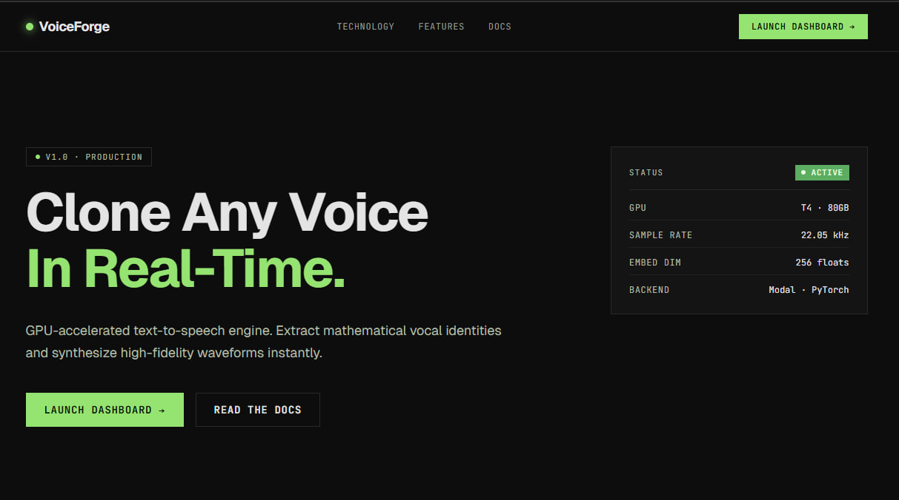

# Real-Time Voice Cloning

This repository contains a Real-Time Voice Cloning application based on the Transfer Learning from Speaker Verification to Multispeaker Text-To-Speech Synthesis (SV2TTS) architecture.



## Project Overview

This project provides a complete pipeline for zero-shot voice cloning, consisting of a deep learning backend deployed on serverless GPUs and a modern web frontend.

The voice cloning process runs through a 3-stage deep learning framework:
1. **Speaker Encoder**: Creates a digital representation (embedding) of a voice from a short audio sample.
2. **Synthesizer**: Generates a mel spectrogram from the target text, conditioned on the speaker embedding.
3. **Vocoder**: Converts the mel spectrogram into a listenable audio waveform.

## Deployment Guide

### 1. Backend: Deploying to Modal

The backend API is designed to be deployed to [Modal](https://modal.com/) for serverless GPU inference. This ensures fast execution without needing a local GPU.

**Prerequisites:**
- Python 3.9+
- A Modal account

**Deployment Steps:**
1. Install the Modal client:
   ```bash
   pip install modal
   ```
2. Authenticate with your Modal account:
   ```bash
   modal setup
   ```
3. Deploy the application to Modal:
   ```bash
   modal deploy modal_app.py
   ```
   This will output the URL of your deployed Modal endpoint (e.g., `https://<your-workspace>--voice-cloning-api.modal.run`).

### 2. Frontend: Web Application

The frontend provides a modern web UI for recording/uploading voice samples, inputting text, and visualizing the generated audio.

**Deployment (Vercel):**
1. Navigate to the frontend directory.
2. Set the required environment variables (e.g., pointing to your Modal backend URL).
3. Deploy using the Vercel CLI:
   ```bash
   npm i -g vercel
   vercel
   ```

## Repository Structure

- **`modal_app.py`**: The Modal deployment script and API endpoints for inference.
- **`encoder/`**: Contains the speaker encoder model and inference logic.
- **`synthesizer/`**: Contains the Tacotron 2 model and inference logic.
- **`vocoder/`**: Contains the WaveRNN model and inference logic.

*For a detailed breakdown of all training scripts, utilities, and inner components, see `readme_files.md`.*

## Original Paper References

| URL                                                    | Designation            | Title                                                                                    |
| ------------------------------------------------------ | ---------------------- | ---------------------------------------------------------------------------------------- |
| [1806.04558](https://arxiv.org/pdf/1806.04558.pdf)     | **SV2TTS**             | Transfer Learning from Speaker Verification to Multispeaker Text-To-Speech Synthesis     |
| [1802.08435](https://arxiv.org/pdf/1802.08435.pdf)     | WaveRNN (vocoder)      | Efficient Neural Audio Synthesis                                                         |
| [1703.10135](https://arxiv.org/pdf/1703.10135.pdf)     | Tacotron (synthesizer) | Tacotron: Towards End-to-End Speech Synthesis                                            |
| [1710.10467](https://arxiv.org/pdf/1710.10467.pdf)     | GE2E (encoder)         | Generalized End-To-End Loss for Speaker Verification                                     |
